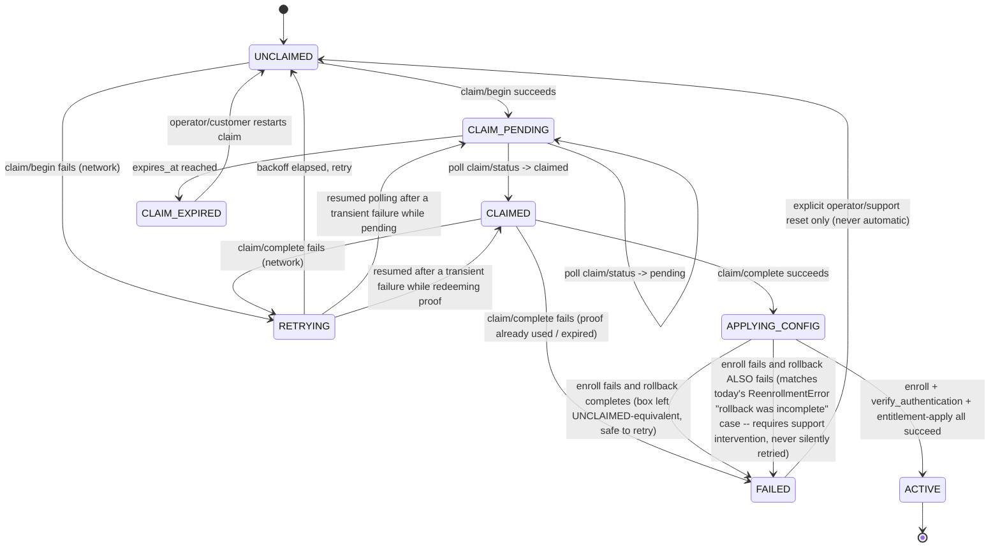

# Non-interactive activation — local state machine

Companion to `docs/non-interactive-activation-design.md` (§8/§9 there
summarize this; this file is the full detail). **Design only -- no
code written.**

## Design rules the state machine must satisfy

1. Every state transition is durably persisted **before** the action it
   authorizes is taken -- the same "stage, then commit, then verify"
   discipline `appliance_activation.py`/`reenrollment.py` already use
   for identity files, applied one layer up.
2. A power loss or process restart at any point resumes from the last
   *durably recorded* state -- never restarts the whole flow, never
   loses track of an in-progress claim.
3. No transition is destructive until the one after it has independently
   verified success (mirrors `coordinated_reenroll()`'s own
   stage-verify-then-replace, never replace-then-verify).
4. Every state is one of a small closed set -- no free-text/derived
   status strings, so `GET .../activation-status` (design doc §12) can
   enumerate every possible value up front.

## States

| State | Meaning | Persisted fields |
|---|---|---|
| `UNCLAIMED` | Fresh install, no claim attempted yet | (none -- absence of a state file *is* this state) |
| `CLAIM_PENDING` | `claim/begin` succeeded; waiting for a customer to complete the portal-side claim | `claim_session_id`, `claim_code`, `expires_at`, `device_id` |
| `CLAIM_EXPIRED` | The claim window elapsed with no customer action | same fields as `CLAIM_PENDING`, plus `expired_at` |
| `CLAIMED` | Portal confirmed the claim; a `claim_proof` is available to redeem | adds `claim_proof` (short-lived, redeemed once) |
| `APPLYING_CONFIG` | `claim/complete` succeeded; running `first_enroll()`/`coordinated_reenroll()` and the entitlement-apply step | adds `appliance_id`, `cloud_id` (identity files themselves are the source of truth from here on, same as today) |
| `ACTIVE` | Identity persisted, verified, entitlements applied, services reloaded | (identity files themselves; this state file can be removed once `ACTIVE` is reached -- `agent.json`/`credential.json`/`appliance_identity.json` are the durable record from here on, exactly as today) |
| `FAILED` | An unrecoverable error occurred (expired session redeemed, server-side conflict, verification failure) | `failed_at`, `reason_code` (never a secret) |
| `RETRYING` | Transient failure (network/timeout); will re-attempt the same step | `retry_count`, `next_attempt_at` |

## Transitions

## Resume-after-restart logic

On agent startup, before doing anything else:

1. If `agent.json`/`credential.json`/`appliance_identity.json` all exist
   → state is `ACTIVE` (or a re-enrollment scenario, unchanged from
   today's `coordinated_reenroll` path -- out of scope for this new
   flow, which only concerns first-time claim).
2. Else if a claim-state file exists → read it. If `expires_at` (or
   `claim_proof`'s own TTL) has passed → transition to `CLAIM_EXPIRED`
   → `UNCLAIMED` without ever calling the server (cheap, local check
   first). Otherwise resume polling/redeeming from exactly that state.
3. Else → `UNCLAIMED`, call `claim/begin`.

This means a power loss at any point loses at most the time until the
next poll interval -- never claim progress, and never risks a duplicate
`claim/begin` (rule: never call `claim/begin` while a non-expired
claim-state file exists on disk).

## Idempotency guarantees, restated as invariants

- **At most one active claim session per device_id**, enforced
  server-side (design doc §9) and mirrored locally (rule above) --
  belt and suspenders, not redundant: the server-side guarantee protects
  against a *different* box or a compromised device_id; the local
  guarantee protects against this exact box's own agent process
  restarting mid-flow.
- **`claim/complete` is safe to call twice with the same
  `claim_proof`** only in the sense that the *second* call must fail
  closed (`FAILED`, reason `proof_already_used`) rather than silently
  succeeding or minting a second credential -- matches today's
  activation-token `used_at IS NULL` guard exactly, applied to the new
  proof value.
- **`APPLYING_CONFIG` → `ACTIVE` reuses `first_enroll()`'s existing
  atomicity untouched**: this state machine's job ends at handing a
  validated activation-response-shaped payload to `first_enroll()`;
  everything from there (staging, agreement-checking, rollback-on-
  failure) is already built, already tested, and out of scope to
  redesign here.

## What is explicitly NOT modeled here (out of scope for this design pass)

- Re-enrollment / re-claiming an already-`ACTIVE` device (existing
  `coordinated_reenroll()` path, unchanged).
- The portal-side state machine (customer login, site selection,
  confirm button) -- design doc §7 lists its endpoints; its own
  internal states are a portal/backend concern, not this appliance-side
  document's.
- Entitlement *changes* after activation (e.g., customer upgrades their
  plan later) -- that's a live-config-refresh concern, not part of the
  one-time activation flow.
