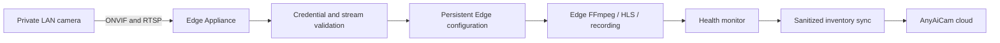

# Phase 5 Sprint 2B — Camera Provisioning & Health

## Scope

Sprint 2B adds the Edge-local workflow that turns a discovered camera into a validated, named, persistent camera configuration. It does not change authentication, CSRF, licensing, billing, Cloudflare, or the cloud registration contract.

The cloud never receives a private IP address, RTSP/ONVIF URL, username, or password. Camera RTSP sessions, FFmpeg, thumbnails, HLS, and recording remain on the Edge Appliance.

## Provisioning workflow

1. Run the existing Edge discovery workflow.
2. Open `/edge/camera-provisioning` as an Edge operator with `manage_settings`.
3. Assign a friendly name and unique local camera number.
4. Supply or confirm the discovered RTSP and optional ONVIF endpoints.
5. Enter credentials and validate them locally.
6. Capture a no-cache thumbnail to confirm the selected stream.
7. Provision the camera. The configuration is persisted and the sanitized inventory is reported through the existing appliance registration framework when configured.
8. Refresh health or synchronize inventory on demand. The normal appliance health loop also refreshes camera health.

Provisioning fails closed when RTSP validation fails or when an available ONVIF endpoint rejects its credentials. Camera URLs must use literal RFC 1918, IPv4 link-local, IPv6 ULA, or IPv6 link-local addresses; public, loopback, and hostname targets are rejected.

## Persistent storage

The following files live beneath `ANYAICAM_CONFIG_ROOT`, which defaults to `/opt/anyaicam/data/config` and is expected to be backed by the existing persistent config volume:

- `camera_inventory.json`: sanitized discovery and provisioning inventory.
- `provisioned_cameras.json`: Edge-only stream endpoints and credentials; written atomically with restrictive file permissions.
- `camera_health.json`: latest health snapshot.

Provisioned camera settings are now the first source used by the existing FFmpeg supervisor. Environment-based `CAMERA<n>_*` settings remain the compatibility fallback.

## Health model

Each configured camera reports:

- RTSP reachability and codec probe result.
- HLS manifest/segment existence and freshness.
- FPS and bitrate reported by the local media probe.
- Recording worker state and newest recording metadata.
- Combined state: `healthy`, `degraded`, `stale`, or `offline`.

Health data contains no credentials or private endpoints. Failures are camera-local and do not stop monitoring of other cameras.

## API endpoints

All endpoints require an authenticated Edge/combined runtime user with `manage_settings`. Existing CSRF middleware protects state-changing requests.

| Method | Endpoint | Purpose |
|---|---|---|
| `GET` | `/api/edge/cameras/configuration` | Redacted persistent configuration |
| `POST` | `/api/edge/cameras/{id}/validate` | Local RTSP and optional ONVIF validation |
| `POST` | `/api/edge/cameras/{id}/provision` | Validate, persist, and sanitize a camera |
| `PATCH` | `/api/edge/cameras/{id}/name` | Rename a provisioned camera |
| `POST` | `/api/edge/cameras/{id}/thumbnail` | Capture an Edge-local JPEG preview |
| `GET` | `/api/edge/cameras/health` | Read the most recent health snapshot |
| `POST` | `/api/edge/cameras/health/refresh` | Run local camera health checks |
| `POST` | `/api/edge/cameras/synchronize` | Refresh health and report sanitized inventory |
| `GET` | `/edge/camera-provisioning` | Provisioning and health user interface |

The existing discovery and inventory-report endpoints remain unchanged.

## Operational notes

- The appliance image must contain `ffprobe` and `ffmpeg`; the current VMS image already uses FFmpeg for streaming and recording.
- Media tools receive a credentialed RTSP URL only within the Edge process invocation. Operators should restrict host process inspection to trusted appliance administrators.
- Thumbnail responses use `Cache-Control: no-store`.
- A cloud synchronization failure does not roll back a successfully validated local configuration.
- No camera must be reachable from AWS. Only the Edge Appliance needs access to the camera LAN.

