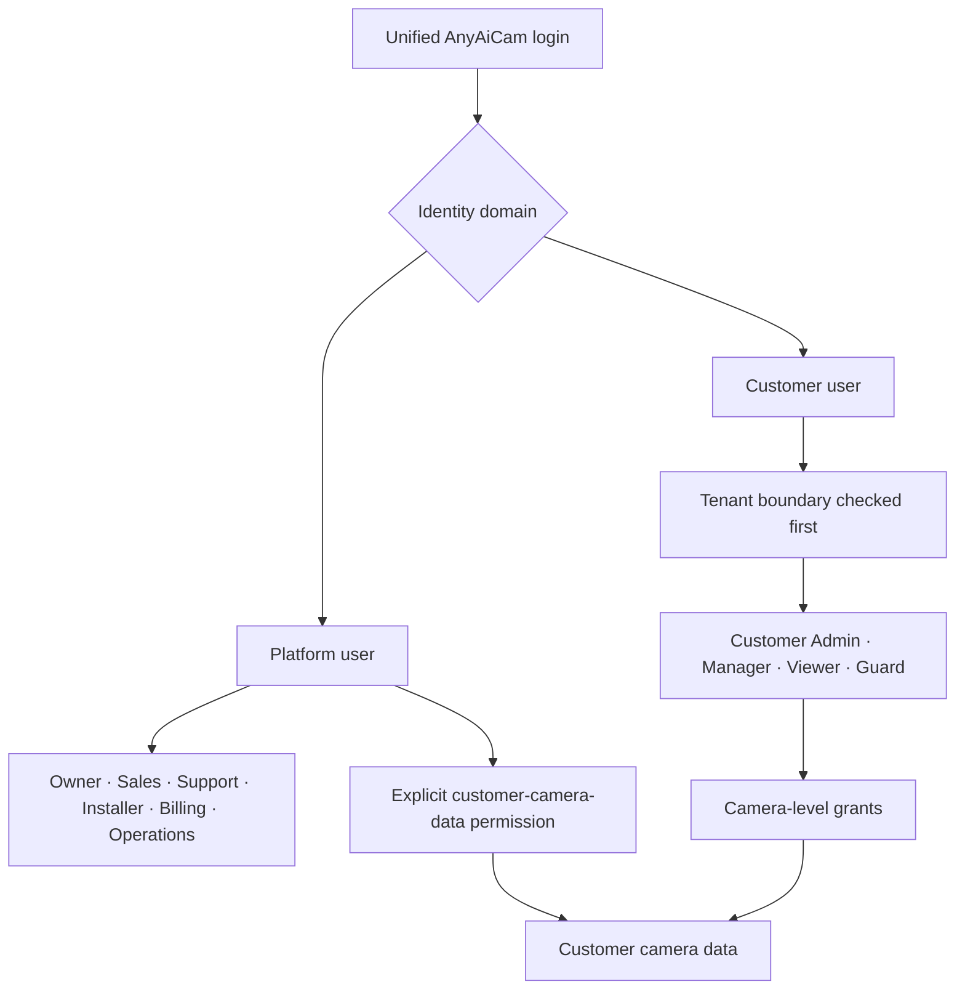

# Phase 6 Sprint 1 — Multi-Tenant Identity Foundation

## Purpose

AnyAiCam now models authentication as one sign-in flow with two independent authorization domains. A signed-in identity is either a platform user or a customer user; it cannot be both.

## Security invariants

- Platform identities do not belong to a customer tenant.
- Customer identities have one `tenant_id` and one membership. A unique membership index prevents a user from joining multiple customer tenants.
- Customer tenant ownership is checked before role permissions.
- Customer users are blocked from platform routes even if they enter a URL directly; hiding navigation is not the security control.
- Platform roles cannot view customer video, playback, downloads, events, snapshots, or clips unless their role carries `customer.camera_data.access`. The Owner role is the initial explicitly authorized role.
- A Customer Admin has all cameras in the organization and can create or update per-camera grants for Manager, Viewer, and Guard users.
- CSRF middleware and the quote-normalizing same-origin fetch wrapper are unchanged.

## Role responsibilities

| Domain | Role | Intended scope |
|---|---|---|
| Platform | Owner | Platform administration and explicitly authorized customer-data access |
| Platform | Sales | Customer creation, CRM, quotes |
| Platform | Support | Account/support metadata and camera health, not video |
| Platform | Installer | Appliance assignment and camera configuration/preview, not customer video browsing |
| Platform | Billing | Subscriptions and licenses |
| Platform | Operations | Appliance fleet, health, and updates |
| Customer | Customer Admin | Organization, users, camera sharing, and all organization cameras |
| Customer | Manager | Operational camera use subject to camera grants |
| Customer | Viewer | Live/playback/event access subject to camera grants |
| Customer | Guard | Live/event access subject to camera grants |

## Modules

- `app/tenancy/policy.py`: domain normalization and tenant-first authorization.
- `app/tenancy/navigation.py`: separate platform and customer menus.
- `app/tenancy/migrations.py`: additive schema and legacy-customer backfill.
- `app/tenancy/service.py`: transactional customer onboarding and camera sharing.
- `app/tenancy/routes.py`: APIs and New Customer wizard.

The implementation remains modular; tenant business logic was not added to `main.py`.

## New Customer transaction

`POST /api/tenants/onboard` creates the tenant, compatibility customer record, primary Customer Admin, default site, subscription, pending license, appliance assignment, membership, and invitation in one database transaction. Failure rolls the complete transaction back.

The generated temporary password must be replaced on first sign-in. The normal AnyAiCam login accepts both legacy local users and database identities and creates the same application session for both.

## Camera sharing APIs

- `GET /api/tenants/{tenant_id}/users/{user_id}/cameras` lists tenant cameras and the selected user's grants.
- `PUT /api/tenants/{tenant_id}/users/{user_id}/cameras/{camera_id}` sets live, playback, download, and management grants.

Both the target user and camera must belong to the actor's tenant. Cross-tenant IDs are rejected.
